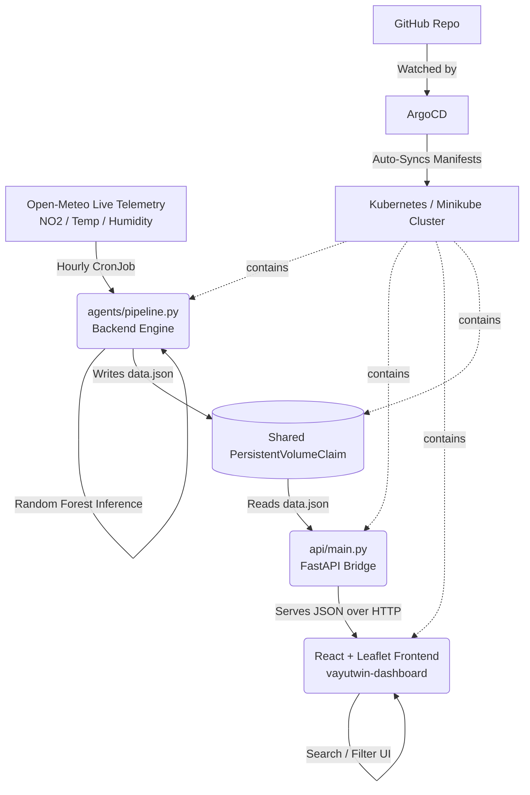

# VayuTwin 🌫️

**AI-Powered Real-Time Air Quality Intelligence Platform**
Built for the Bharatiya Antariksh Hackathon 2026 (ISRO) — Problem Statement 03/05 (Surface AQI & HCHO Hotspot Identification using Satellite Data)

VayuTwin converts raw atmospheric trace-gas telemetry into ground-level, human-readable Air Quality Index (AQI) predictions, and visualizes them live on an interactive map of India. It is built as a fully containerized, GitOps-deployed microservice architecture running on Kubernetes.

---

## 1. What This Project Actually Does

Satellites measure pollution as a **Vertical Column Density (VCD)** — the total amount of a gas from the top of the atmosphere down to the ground. Humans only breathe surface-level air. VayuTwin's job is to take that satellite/atmospheric signal, run it through a model, and output a **Surface AQI** value per city, specifically tracking **Formaldehyde (HCHO)** — a key VOC and precursor to ground-level ozone.

In plain terms: raw atmospheric data goes in → an ML pipeline crunches it → a clean, searchable, mapped AQI dashboard comes out.

---

## 2. Architecture Overview

This is a **GitOps-driven, Kubernetes-native microservice system** — no public cloud provider required, runs entirely on a local Minikube cluster.



### Core Components

| Component | Folder | Role |
|---|---|---|
| **Backend Engine** | `agents/pipeline.py` | Kubernetes `CronJob`. Wakes up hourly, pulls live NO₂/temperature/humidity data from the Open-Meteo API for 6 Indian cities, runs a Random Forest model to compute a predicted AQI, and writes the result to a shared volume as `data.json`. |
| **API Bridge** | `api/main.py` | A lightweight, always-on FastAPI service. Reads `data.json` from the shared volume and serves it over HTTP (`/data`) so the frontend never has to touch the pipeline directly. |
| **Frontend Dashboard** | `frontend/` | React + Vite + Tailwind CSS. Fetches live data from the API bridge, renders city-level AQI cards, and plots color-coded hotspots on an interactive **Leaflet** map of India (dark-themed CARTO tiles). Includes a live search bar that filters both the city list *and* the map markers simultaneously. |
| **Shared Storage** | `k8s/storage.yaml` | A `PersistentVolumeClaim` mounted at `/shared` in both the backend and API pods — this is the "USB drive" that bridges the two otherwise-isolated containers. |
| **Research/EDA** | `notebooks/ISRO_hackathon.ipynb` | The original exploratory data analysis and model-training notebook (kept separate from production code). |
| **GitOps Engine** | ArgoCD | Continuously watches the GitHub repo's `k8s/` folder and auto-syncs the live cluster to match it — zero manual `kubectl apply` needed once configured. |

### Why This Design

- **CronJob, not a web server** for the backend — the ML workload is bursty (runs once an hour), so there's no reason to keep it alive 24/7 burning resources.
- **Separate API layer** — keeps the heavy ML/data-fetching logic completely decoupled from the user-facing request path, so the dashboard stays fast even if the pipeline is mid-run.
- **PVC as a data bridge** — avoids needing a full database for an MVP while still letting two independently-scaling pods share state.
- **GitOps over manual deploys** — every infrastructure change is a Git commit; the cluster is just a reflection of the repo.

---

## 3. Prerequisites & Installation

You need: **Git**, **Docker**, **kubectl**, and **Minikube**.

### Linux (Ubuntu/Debian)

```bash
sudo apt update
sudo apt install -y git docker.io

# kubectl
curl -LO "https://dl.k8s.io/release/$(curl -L -s https://dl.k8s.io/release/stable.txt)/bin/linux/amd64/kubectl"
sudo install -o root -g root -m 0755 kubectl /usr/local/bin/kubectl

# minikube
curl -LO https://storage.googleapis.com/minikube/releases/latest/minikube-linux-amd64
sudo install minikube-linux-amd64 /usr/local/bin/minikube

# Add yourself to the docker group (avoids permission errors), then reboot
sudo usermod -aG docker $USER
```

> ⚠️ After running `usermod`, **reboot your machine** — this is the most reliable way to get the new Docker group permissions to actually apply to your terminal sessions.

### Windows (PowerShell)

```powershell
winget install Kubernetes.kubectl
winget install Git.Git
# Install Docker Desktop manually and ensure it's running
winget install Kubernetes.minikube
```

---

## 4. Project Structure

```
vayu-twin-hcho/
│
├── agents/
│   └── pipeline.py           # ML ingestion + inference engine (CronJob)
│
├── api/
│   └── main.py                # FastAPI bridge serving data.json
│
├── frontend/
│   ├── src/
│   │   └── App.jsx            # React dashboard + Leaflet map + search
│   ├── package.json
│   └── Dockerfile
│
├── backend/
│   ├── requirements.txt
│   └── Dockerfile
│
├── notebooks/
│   └── ISRO_hackathon.ipynb   # EDA / model training (research only)
│
├── k8s/                        # All manifests — watched by ArgoCD
│   ├── storage.yaml            # PersistentVolumeClaim (the data bridge)
│   ├── backend-cronjob.yaml    # Hourly pipeline job
│   ├── api-server.yaml         # FastAPI deployment + service
│   └── frontend-deployment.yaml# React dashboard deployment + service
│
├── infrastructure/
│   └── terraform/              # (optional) IaC for provisioning
│
├── .gitignore
└── README.md
```

---

## 5. Running It Locally — Step by Step

### Step 1: Start the cluster

```bash
minikube start --cpus=4 --memory=8192
```

### Step 2: Install ArgoCD (one-time setup)

```bash
kubectl create namespace argocd
kubectl apply -n argocd -f https://raw.githubusercontent.com/argoproj/argo-cd/stable/manifests/install.yaml
```

### Step 3: Build images directly into Minikube's Docker daemon

Minikube has its own isolated Docker engine — point your shell at it before building, or your images won't be visible to the cluster.

```bash
eval $(minikube docker-env)        # Linux/macOS
# or: & minikube -p minikube docker-env --shell powershell | Invoke-Expression   (Windows PowerShell)

docker build -t vayutwin-backend:latest ./backend
docker build -t vayutwin-frontend:latest ./frontend
docker build -t vayutwin-api:latest ./api
```

### Step 4: Push manifests to GitHub, then point ArgoCD at the repo

```bash
git add .
git commit -m "deploy: initial VayuTwin manifests"
git push origin main
```

In the ArgoCD UI (see Step 5), create a new app pointing at your repo's `k8s/` folder with **Automatic** sync enabled.

### Step 5: Open the ArgoCD dashboard

```bash
kubectl port-forward svc/argocd-server -n argocd 8080:443
kubectl -n argocd get secret argocd-initial-admin-secret -o jsonpath="{.data.password}" | base64 -d; echo
```

Visit `https://localhost:8080` → log in with `admin` and the password printed above.

### Step 6: Expose the app to your browser

```bash
kubectl port-forward deployment/vayutwin-dashboard 3000:80
kubectl port-forward deployment/api-server 8000:8000
```

Visit `http://localhost:3000`.

### Step 7: Force a manual pipeline run (don't wait for the hourly schedule)

```bash
kubectl create job --from=cronjob/vayutwin-pipeline manual-run-1
kubectl logs -f -l job-name=manual-run-1
```

You should see it pull live data city-by-city, run inference, and end with:
`Successfully wrote data to /shared/data.json`

---

## 6. Stopping & Restarting Safely (No Data Loss)

Kubernetes state is declarative — stopping Minikube does **not** delete your pods, volumes, or config. It just pauses everything.

**Shutdown:**
```bash
# Ctrl+C any active port-forward terminals first
minikube stop
```

**Startup:**
```bash
minikube start
kubectl get pods            # wait until everything shows "Running"
kubectl port-forward deployment/api-server 8000:8000
kubectl port-forward deployment/vayutwin-dashboard 3000:80
```

---

## 7. The Data Pipeline, Explained Simply

1. **Ingest** — `agents/pipeline.py` calls the free Open-Meteo Air Quality + Forecast APIs for 6 cities (Delhi, Kanpur, Kolkata, Mumbai, Chennai, Bengaluru), pulling NO₂ (used as an HCHO/trace-gas proxy), temperature, and humidity.
2. **Infer** — A `RandomForestRegressor` combines the trace-gas signal with weather variables to compute a `predicted_aqi`, then bins it into a risk category (`Good` / `Moderate` / `Unhealthy` / `Hazardous`).
3. **Export** — Results are serialized to JSON and written to the shared `PersistentVolumeClaim` at `/shared/data.json`.
4. **Serve** — `api/main.py` reads that file on demand and exposes it at `GET /data`.
5. **Visualize** — The React frontend fetches `/data`, renders a searchable city list, and plots color-coded `CircleMarker`s on a Leaflet map (green = Good, orange = Moderate/Unhealthy, red = Hazardous).

> **Important distinction for demos:** the number shown on the dashboard (e.g. `185`) is the **computed AQI**, not the raw HCHO VCD. The raw satellite/trace-gas density is a tiny scientific value (~0.0001 mol/m²) that gets transformed by the model into that human-readable AQI score.

---

## 8. Known Limitations / Honest Notes

- **HCHO proxy, not direct measurement**: due to time constraints, live NO₂ from Open-Meteo is used as a stand-in signal for the satellite HCHO VCD originally specified in the problem statement (Sentinel-5P/TROPOMI). Swapping in real TROPOMI data via Google Earth Engine is the natural next step (see `notebooks/`).
- **Frontend and backend are loosely coupled** via a flat JSON file on a shared volume rather than a database — sufficient for an MVP/hackathon, not for production scale.
- **MLOps Pipeline tab** in the sidebar is currently a UI placeholder representing planned future work (model drift monitoring, retraining triggers, pipeline health status).

---

## 9. Troubleshooting

| Symptom | Likely Cause | Fix |
|---|---|---|
| Blank/black dashboard screen | Stale Docker image cached by Kubernetes | Rebuild with a new tag (`:v2`, `:v3`...) and `kubectl set image deployment/<name> *=<image>:<tag>`, then `kubectl rollout restart deployment/<name>` |
| `e.filter is not a function` in browser console | API hasn't returned an array yet | Guard with `Array.isArray(data) ? data : []` before `.filter()` |
| API returns `"Data not ready yet"` | Pipeline hasn't run yet, or volume mount path mismatch between CronJob and API pod | Force a manual job run; verify both manifests mount the PVC at the same path (`/shared`) |
| `ContainerCreating` stuck | First-time image pull/build still in progress | `kubectl get pods -w` and wait |
| `npx tailwindcss init -p` → "could not determine executable" | Broken local npm cache, or Tailwind v4's PostCSS plugin moved packages | Manually create `tailwind.config.js`/`postcss.config.js`, and install `@tailwindcss/postcss` if on Tailwind v4 |
| `permission denied ... docker.sock` | User not in `docker` group yet | `sudo usermod -aG docker $USER` then **reboot** |
| ArgoCD: `app path does not exist` | `k8s/` folder wasn't actually pushed to GitHub | `git add k8s/ && git commit -m "add manifests" && git push` |

---

## 10. Tech Stack Summary

**Frontend:** React, Vite, Tailwind CSS, Leaflet (`react-leaflet`), Lucide icons
**Backend:** Python, FastAPI, pandas, scikit-learn (Random Forest), requests
**Data Source:** Open-Meteo Air Quality & Forecast APIs (live), Sentinel-5P/TROPOMI (research notebook)
**Infrastructure:** Docker, Kubernetes (Minikube), ArgoCD (GitOps CD), PersistentVolumeClaim
**Future Scope:** Terraform IaC modules, real TROPOMI ingestion via Google Earth Engine, MLOps dashboard for model monitoring

---

*Built for the Bharatiya Antariksh Hackathon 2026.*
